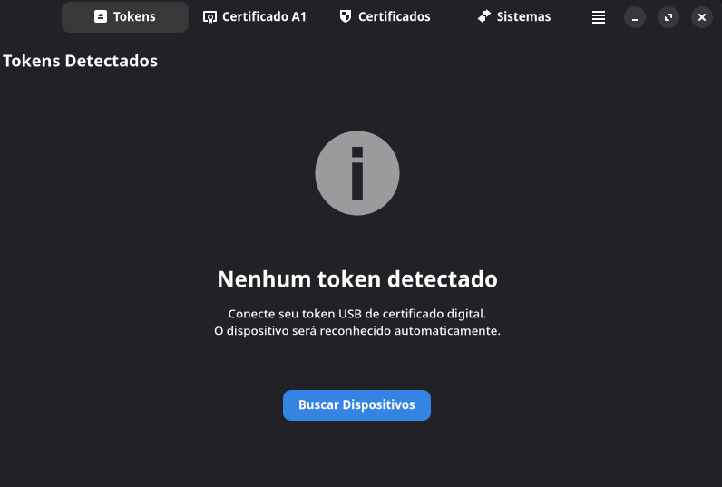

<p align="center">
  
</p>

<h1 align="center">BigCertificados</h1>

<p align="center">
Gerenciador completo de certificados digitais para advogados e profissionais do Direito no GNU/Linux — certificados A1 (PFX/P12), A3 (token USB), assinatura digital de PDFs, integração com navegadores, acesso a sistemas judiciais e gerenciamento de drivers.
</p>

<p align="center">
  
  
  
  
  
  
  
</p>

> ⚠️ **Este projeto está em fase de desenvolvimento e testes.**
> Ainda não está pronto para uso em produção. Use por sua conta e risco.

---

## Índice

- [Visão Geral](#visão-geral)
- [Screenshot](#screenshot)
- [Funcionalidades](#funcionalidades)
  - [Certificados A3 (Token USB)](#certificados-a3-token-usb)
  - [Certificados A1 (PFX/P12)](#certificados-a1-pfxp12)
  - [Integração com Navegadores](#integração-com-navegadores)
  - [Sistemas Judiciais Eletrônicos](#sistemas-judiciais-eletrônicos)
  - [Assinador Digital de PDF](#assinador-digital-de-pdf)
  - [VidaaS Connect (Certificado em Nuvem)](#vidaas-connect-certificado-em-nuvem)
  - [PJeOffice Pro](#pjeoffice-pro)
  - [Gerenciador de Drivers & Tokens](#gerenciador-de-drivers--tokens)
  - [Busca Global](#busca-global)
  - [Proteção por Senha](#proteção-por-senha)
- [Soluções Exclusivas](#soluções-exclusivas)
  - [PJeOffice Pro — Escala HiDPI Automática](#pjeoffice-pro--escala-hidpi-automática)
  - [Brave — Configuração Automática para PJe Office](#brave--configuração-automática-para-pje-office)
- [Tokens e Drivers Suportados](#tokens-e-drivers-suportados)
- [Sistemas Judiciais Disponíveis](#sistemas-judiciais-disponíveis)
- [Arquitetura](#arquitetura)
- [Requisitos](#requisitos)
- [Instalação](#instalação)
- [Configuração](#configuração)
- [Uso](#uso)
- [Segurança](#segurança)
- [Desinstalação](#desinstalação)
- [Contribuindo](#contribuindo)
- [Licença](#licença)
- [Créditos](#créditos)

---

## Visão Geral

BigCertificados é um aplicativo **GTK4/Adwaita** criado para o ecossistema do
[BigLinux](https://biglinux.com.br),
[BigCommunity](https://communitybig.org/) e distribuições baseadas no
**Arch Linux** (Manjaro, EndeavourOS, CachyOS e outras). Ele simplifica o uso
de certificados digitais no GNU/Linux — uma tarefa historicamente complexa para
quem precisa acessar sistemas judiciais eletrônicos como PJe, PROJUDI e e-SAJ.

### O que o BigCertificados faz

| Recurso | Descrição |
|---------|-----------|
| **Detecção de tokens USB** | Hotplug automático via udev — conecte o token e ele aparece |
| **Certificados A1 e A3** | Visualização unificada de certificados PFX/P12 e tokens PKCS#11 |
| **Assinador digital de PDF** | Assinatura ICP-Brasil com carimbo visual, em lote |
| **39 sistemas judiciais** | Acesso com um clique, organizados por estado e tribunal |
| **68 drivers catalogados** | Gerenciador de drivers com instalação automática via AUR |
| **6 navegadores suportados** | Firefox, Chrome, Chromium, Brave, Edge e Opera |
| **Busca global** | Pesquisa em toda a aplicação com Ctrl+F |
| **PJeOffice Pro** | Instalador, atualizador e desinstalador integrados |
| **VidaaS Connect** | Assinatura em nuvem via Valid Certificadora |
| **Proteção por senha** | PBKDF2-HMAC-SHA256 com 600.000 iterações |

## Screenshot



---

## Funcionalidades

### Certificados A3 (Token USB)

- **Detecção automática** de tokens USB via udev — conecte e o dispositivo
  aparece instantaneamente na interface
- **Banco de dados** com 40+ modelos de tokens de fabricantes como Gemalto,
  SafeNet, Aladdin, Feitian, Watchdata, G&D, Bit4id, Cherry, ACS, HID e Yubico
- **Identificação do módulo PKCS#11** — verifica automaticamente se o driver
  correto (`.so`) está instalado no sistema
- **Leitura de certificados** via PIN — exibe titular, CPF, OAB, validade,
  emissor, número de série, algoritmo e uso do certificado
- **Hotplug** — monitora conexão e desconexão de dispositivos em tempo real
  usando `pyudev`
- **Diálogo de PIN seguro** — campo mascarado com integração direta ao
  `PyKCS11.Session`

**Fabricantes compatíveis:**

| Fabricante | Modelos |
|-----------|---------|
| SafeNet (Thales) | eToken 5110, 5300, 7300, PRO 72K, PRO Java |
| Gemalto (Thales) | IDBridge CT40/CT710/K30/K50, IDPrime MD |
| Watchdata | ProxKey, GD e-Pass |
| Feitian | ePass 2003/3003, BioPass, Rockey, FIDO-NFC |
| Taglio | DinKey |
| GD Burti | StarSign CUT S |
| Oberthur (IDEMIA) | IDOne Cosmo V7 |
| Bit4id | miniLector EVO, Digital-DNA Key |
| Athena | ASEDrive IIIe, ASECard Crypto |
| ACS | ACR38U, ACR39U |
| Cherry | ST-2000, SmartTerminal |
| SCM Microsystems | SCR 3310, SCR 3500 |
| HID Global | OMNIKEY 3021, 5021 CL |
| Yubico | YubiKey 5 NFC, 5C, 5Ci |
| Kryptus | kNET HSM Token |
| AET Europe | SafeSign Token |

**Certificadoras brasileiras compatíveis:**
Certisign, Serasa Experian, Soluti, Valid Certificadora, Safeweb, AC OAB

### Certificados A1 (PFX/P12)

- **Carregamento de arquivos** PFX e P12 com solicitação segura de senha
- **Visualização completa** — titular, CPF, OAB, validade, emissor, número de
  série, algoritmo de assinatura, uso e Subject Alternative Names
- **Indicador de validade** — banner visual colorido mostrando se o certificado
  está válido (verde), próximo do vencimento (amarelo) ou expirado (vermelho)
- **Instalação nos navegadores** via NSS/certutil com um clique
- **Visualização unificada** — certificados A1 e A3 em uma mesma aba com
  widgets compartilhados (`certificate_widgets.py`)

### Integração com Navegadores

O BigCertificados detecta automaticamente todos os navegadores baseados em
Chromium e o Firefox, incluindo todos os seus perfis:

| Navegador | Detecção | Configuração NSS | Brave Shields |
|-----------|----------|-------------------|---------------|
| **Firefox** | ✅ Perfis `~/.mozilla/firefox/` | ✅ certutil | — |
| **Chrome** | ✅ Perfis `~/.config/google-chrome/` | ✅ certutil | — |
| **Chromium** | ✅ Perfis `~/.config/chromium/` | ✅ certutil | — |
| **Brave** | ✅ Perfis `~/.config/BraveSoftware/` | ✅ certutil | ✅ Auto-config |
| **Edge** | ✅ Perfis `~/.config/microsoft-edge/` | ✅ certutil | — |
| **Opera** | ✅ Perfis `~/.config/opera/` | ✅ certutil | — |

**O que é feito automaticamente:**

1. **Certificados A1** — importa o certificado PFX no banco NSS de cada perfil
2. **Módulo PKCS#11 (A3)** — registra o módulo `.so` do token em cada perfil
   via `modutil`
3. **Brave Shields** — desativa o bloqueio nos domínios judiciais conhecidos
   (veja seção [Brave — Configuração Automática](#brave--configuração-automática-para-pje-office))
4. **Certificado PJeOffice** — importa o certificado auto-assinado do PJeOffice
   no banco NSS do Brave

#### Detalhes técnicos

- Utiliza `certutil` e `modutil` do pacote `nss` (libnss3-tools)
- Busca binários de forma segura usando `shutil.which`
- Detecção de Opera via caminho `~/.config/opera/`
- Cada operação é executada em thread separada (`GLib.idle_add` para retorno ao
  main loop GTK)

### Sistemas Judiciais Eletrônicos

A seção **Sistemas** utiliza `Adw.OverlaySplitView` com sidebar colapsável,
organizando 4 seções: Sistemas Judiciais, PJeOffice Pro, Drivers & Tokens
e Navegadores.

O BigCertificados oferece acesso direto a **39 sistemas judiciais**, organizados
por tribunal e estado, em **8 regiões**:

| Região | Tribunais / Sistemas |
|--------|---------------------|
| **Tribunais Superiores** | PJe-STJ, Consulta STJ, PJe-TST, Portal PJe-CNJ |
| **Bahia** | PJe-TJBA (1ª/2ª), PJe-TRF1 (1ª/2ª), PJe-TRT5, PROJUDI-TJBA, e-SAJ-TJBA |
| **São Paulo** | eSAJ-TJSP (1ª/2ª), Portal eSAJ-TJSP, PJe-TRT2 |
| **Distrito Federal** | PJe-TJDFT (1ª/2ª), PJe-TRT10, Consulta TJDFT |
| **Rio de Janeiro** | PJe-TJRJ (1ª/2ª), PJe-TRF2, PJe-TRT1, Consulta TJRJ |
| **Minas Gerais** | PJe-TJMG (1ª/2ª), PJe-TRT3, PROJUDI-TJMG, Consulta TJMG |
| **Rio Grande do Sul** | eThemis-TJRS (1ª/2ª), PJe-TRF4, PJe-TRT4, Consulta TJRS |
| **Paraná** | PROJUDI-TJPR, PJe-TJPR (1ª/2ª), PJe-TRT9, Consulta TJPR |

Cada sistema é aberto com um clique no navegador padrão. A interface utiliza
`Adw.ActionRow` + `Adw.PreferencesGroup` com ícones descritivos para cada tipo
de sistema (PJe, PROJUDI, eSAJ, Consulta).

### Assinador Digital de PDF

O assinador produz documentos **válidos e verificáveis** em conformidade com o
padrão ICP-Brasil, compatíveis com Adobe Acrobat, Foxit, Okular e os
validadores oficiais do gov.br.

| Característica | Detalhe técnico |
|----------------|-----------------|
| **Formato** | Adobe.PPKLite / adbe.pkcs7.detached |
| **Hash** | SHA-256 |
| **Biblioteca** | endesive (CMS/PKCS#7) |
| **Carimbo visual** | Pillow + ReportLab |
| **Posicionamento** | Última página, primeira página ou todas as páginas |
| **Lote** | Múltiplos PDFs com barra de progresso (`Gtk.ProgressBar`) |
| **Limpeza** | Arquivo temporário de carimbo removido via `try/finally` |

**Dados exibidos no carimbo:** nome do signatário, CPF, OAB (se presente),
Autoridade Certificadora, data/hora e motivo/localidade opcionais.

**Fluxo guiado (wizard de 4 passos):**

1. **Documentos** — selecione os PDFs a serem assinados
2. **Certificado** — escolha tipo (A1/A3/VidaaS) e selecione o certificado
3. **Opções** — motivo, local, carimbo visível e configuração do Papers
4. **Assinatura** — progresso em tempo real e resultados por arquivo

### VidaaS Connect (Certificado em Nuvem)

Integração scaffold com a API REST da **Valid Certificadora** para assinatura
digital em nuvem:

- **OAuth2** — autenticação com `client_id`, `client_secret` e `username`
- **Listagem de certificados** — obtém certificados do cofre do usuário
- **Assinatura remota** — envia hash para assinatura no servidor HSM da Valid
- **Callback de status** — `Callable[[VidaaSSignatureResult], None]` para
  atualização de UI em tempo real
- **Timeout configurável** — padrão de 30s para operações HTTP
- **Base URL** — `https://certificado.vidaas.com.br/v0`

> **Nota:** Esta funcionalidade requer credenciais da Valid Certificadora e
> está em fase de implementação. A API pode mudar conforme documentação oficial.

### PJeOffice Pro

Gerenciamento completo do PJeOffice Pro diretamente na aplicação:

| Recurso | Descrição |
|---------|-----------|
| **Detecção** | Verifica se está instalado e exibe a versão atual |
| **Instalação** | Download direto do CNJ/TRF3 com progresso visual e log em tempo real |
| **Atualização** | Verificação manual e automática (a cada 24h via `updater.py`) |
| **Desinstalação** | Remoção completa com confirmação e log de execução |
| **Execução** | Botão para abrir o PJeOffice Pro diretamente |
| **Escalação** | Scripts helper via `pkexec` para operações com privilégio |

**Versão canônica:** definida em `src/utils/updater.py` como
`PJEOFFICE_VERSION` — fonte única de verdade usada por todos os módulos.

**Scripts de instalação (`scripts/`):**

- `install-pjeoffice-pro.sh` — Detecta HiDPI (XWayland, Mutter DBus, EDID) e
  lança o PJeOffice com `-Dsun.java2d.uiScale` correto
- `pjeoffice-install-helper.sh` — Instalador com `pkexec` (copia JAR, cria
  links, instala certificado)
- `pjeoffice-uninstall-helper.sh` — Desinstalador com `pkexec` (remove tudo)

### Gerenciador de Drivers & Tokens

Seção dedicada na aba Sistemas para instalar, verificar e gerenciar todos os
drivers e middleware necessários para tokens criptográficos:

**68 drivers catalogados em 6 categorias:**

| Categoria | Quantidade | Exemplos |
|-----------|-----------|----------|
| **Pacotes Base** | 4 | PC/SC Daemon, CCID, OpenSC, NSS Tools |
| **Tokens Brasileiros** | 6 | SafeNet eToken, Serasa (G&D), SafeSign, Receita Federal, SCM, OpenWebStart |
| **eID Europeus** | 31 | Portugal, Bélgica, Alemanha, França, Itália, Espanha, Áustria, Suíça, e mais 23 |
| **eID Ásia & Outros** | 22 | Rússia, Ucrânia, China, Japão, Coreia, Índia, e mais 16 |
| **Hardware de Segurança** | 3 | YubiKey (Personalização), YubiKey Manager, Nitrokey |
| **Ferramentas** | 2 | PKCS#11 Tools, PC/SC Tools |

**Funcionalidades do gerenciador:**

- **Status visual** — cada driver mostra badge "Instalado" (verde) ou
  "Não instalado" (laranja)
- **Verificação eficiente** — `pacman -Qq` executado uma única vez para todos
  os drivers (não N chamadas individuais)
- **Instalação com um clique** — abre `yay -S <pacote>` ou
  `sudo pacman -S <pacote>` no terminal
- **Validação de segurança** — nomes de pacotes validados via regex
  `^[a-zA-Z0-9][a-zA-Z0-9._+-]*$` antes de execução
- **Atualização em lote** — botão "Atualizar Tudo" recarrega o status de todos
  os drivers

**Detalhes técnicos por driver:**

Cada `TokenDriver` inclui: nome, pacotes (`tuple[str, ...]`), fonte
(`official`/`aur`), categoria, descrição, ícone, caminho da biblioteca
PKCS#11 (`.so`) e comando de verificação.

### Busca Global

O BigCertificados inclui um sistema de busca global acessível via
**Ctrl+F** ou pelo ícone de lupa no cabeçalho:

- **Busca integrada** — `Gtk.SearchBar` + `Gtk.SearchEntry` sincronizados
  com `Gtk.ToggleButton` via `GObject.BindingFlags.BIDIRECTIONAL`
- **Escopo completo** — pesquisa em:
  - Abas de navegação (Certificados, Sistemas, Assinador, VidaaS)
  - Ações do menu (Configurar Navegadores, Proteção por Senha, Sobre)
  - Sistemas judiciais (39 sistemas com nome, tribunal e URL)
  - Drivers & Tokens (68 entries com nome e descrição)
  - Navegadores detectados (Firefox, Chrome, Brave, etc.)
  - PJeOffice Pro (instalar, atualizar, abrir)
- **Navegação direta** — clicar em um resultado leva diretamente à aba e
  seção correspondente (ex.: resultado de driver → aba Sistemas → seção
  Drivers & Tokens)
- **Cache de perfis** — perfis de navegador são cacheados durante a sessão
  de busca para evitar chamadas repetidas ao sistema de arquivos

### Proteção por Senha

- **Bloqueio opcional** do aplicativo com senha definida pelo usuário
- **PBKDF2-HMAC-SHA256** com 600.000 iterações para derivação de chave
  (padrão OWASP)
- **Comparação segura** — usa `secrets.compare_digest` em bytes (resistente
  a timing attacks)
- **Limite de tentativas** — 3 erros antes de bloquear o acesso
- **Permissões restritas** — arquivo `applock.json` com `chmod 0600`
- **Nenhum segredo em código** — senhas nunca são armazenadas em texto plano

---

## Soluções Exclusivas

### PJeOffice Pro — Escala HiDPI Automática

> 🆕 **Solução inédita desenvolvida pelo time BigLinux / BigCommunity.**
> O PJeOffice Pro (Java Swing) exibe janelas minúsculas em monitores de alta
> resolução — problema que afeta **inclusive o Windows** e que nunca teve
> correção pública. No GNU/Linux com Wayland, o problema é ainda mais grave,
> porque a detecção padrão de DPI simplesmente não funciona.

O BigCertificados resolve isso automaticamente no launcher do PJeOffice com uma
cadeia de detecção robusta:

1. **XWayland auto-detect** — localiza o processo XWayland ativo e obtém
   `DISPLAY` e `XAUTHORITY` corretos (resolve variáveis desatualizadas quando
   o XWayland reinicia em sessões Wayland)
2. **Método 1 — `Xft.dpi`** do X Resource Database (funciona em X11 e
   Wayland via XWayland)
3. **Método 2 — Mutter DBus** — consulta o `DisplayConfig` do GNOME para
   obter a escala fracionária do monitor (`1.25x`, `1.333x`, `1.5x`, etc.)
4. **Método 3 — EDID físico** — lê o tamanho físico do painel (cm) e a
   resolução nativa diretamente de `/sys/class/drm/` para calcular o DPI real
   do monitor (ex.: 2560×1600 em 34 cm = 191 DPI)
5. **Compensação `xwayland-native-scaling`** — quando o GNOME usa escala
   fracionária com a feature `xwayland-native-scaling` habilitada, o XWayland
   renderiza na resolução nativa do painel. Nesse caso, o fator EDID é
   multiplicado pela escala do Mutter (ex.: `1.99 × 1.333 = 2.5`)
6. O resultado final é passado como `-Dsun.java2d.uiScale` ao Java

| Cenário | Detecção | uiScale |
|---------|----------|---------|
| Full HD (1080p), sem escala | — | 1 |
| QHD, GNOME 1.25x | Mutter DBus | 1.25 |
| QHD, GNOME 1.5x | Mutter DBus | 1.50 |
| 4K / UHD, GNOME 2.0x | Xft.dpi ou Mutter | 2 |
| WQXGA (2560×1600), GNOME 1.333x + xwayland-native-scaling | EDID (191 DPI) × Mutter (1.333) | 2.5 |
| 5K, GNOME 2.0x | Xft.dpi ou EDID | 2.50 |

> **Resultado:** diálogos como "Seleção de certificado" e a interface principal
> do PJeOffice ficam legíveis e proporcionais em qualquer monitor — da tela
> Full HD do notebook até um monitor 5K externo. Funciona corretamente mesmo
> com escalas fracionárias e `xwayland-native-scaling` habilitado.

### Brave — Configuração Automática para PJe Office

> 🆕 **Solução inédita desenvolvida pelo time BigLinux / BigCommunity.**
> Até então, não existia documentação ou solução pública para usar o PJe
> Office com o navegador Brave no GNU/Linux.

O Brave bloqueia, por padrão, a comunicação entre os sites dos tribunais e o
PJe Office (servidor local na porta 8801). Isso acontece porque o **Brave
Shields** impede requisições cross-origin para `localhost` com certificado
auto-assinado.

O BigCertificados resolve isso automaticamente com um clique:

1. **Desativa o Shields** nos domínios judiciais conhecidos (PJe, PROJUDI,
   e-SAJ, TST, TRT, TRF, CNJ) — escrito diretamente no `Preferences` JSON
   do Brave
2. **Importa o certificado** do PJe Office no banco NSS do navegador via
   `certutil`
3. O PJe Office passa a ser detectado normalmente pelo Brave

**Configuração manual (sem o BigCertificados):**

1. Abra o Brave e acesse `https://127.0.0.1:8801` — aceite o aviso de
   certificado
2. No site do PJe, clique no **ícone do Brave Shields** (leão) na barra de
   endereço → **Desative** o Shields
3. Recarregue a página — o PJe Office será detectado

---

## Tokens e Drivers Suportados

### Detecção automática de tokens (`token_database.py`)

O banco de dados de tokens identifica automaticamente o dispositivo USB pelo
`vendor_id`/`product_id` e mapeia para o módulo PKCS#11 correto:

| Fabricante | Modelos | Driver PKCS#11 |
|-----------|---------|----------------|
| SafeNet (Thales) | eToken 5110, 5300, 7300, PRO 72K, PRO Java | `libeToken.so` |
| Gemalto (Thales) | IDBridge CT40/CT710/K30/K50, IDPrime MD | `libeToken.so` |
| Watchdata | ProxKey, GD e-Pass | `libwdpkcs.so` |
| Feitian | ePass 2003/3003, BioPass, Rockey, FIDO-NFC | `opensc-pkcs11.so` |
| GD Burti | StarSign CUT S | `libaetpkss.so` |
| Bit4id | miniLector EVO, Digital-DNA Key | `opensc-pkcs11.so` |
| Yubico | YubiKey 5 NFC, 5C, 5Ci | `opensc-pkcs11.so` |
| Kryptus | kNET HSM Token | `libiccbridge.so` |

### Drivers PKCS#11 — Gerenciador integrado (`driver_database.py`)

O BigCertificados inclui um gerenciador de 68 drivers com verificação de
instalação em tempo real e instalação com um clique:

**Pacotes essenciais (repositório oficial):**

| Pacote | Descrição |
|--------|-----------|
| `pcsclite` | PC/SC Daemon — comunicação com leitores e tokens |
| `ccid` | Driver genérico para leitores USB CCID |
| `opensc` | Módulo PKCS#11 genérico para smart cards |
| `nss` | certutil e modutil — configuração de navegadores |

**Pacotes para tokens brasileiros (AUR):**

| Pacote | Tokens | Biblioteca |
|--------|--------|-----------|
| `etoken` | SafeNet eToken 5110/5300/7300, IDPrime MD | `libeToken.so` |
| `libaet` | Token Serasa (G&D / Valid) | `libaetpkss.so` |
| `safesignidentityclient` | GD Burti, StarSign Crypto USB | `libaetpkss.so` |
| `libiccbridge` | Token Receita Federal / Kryptus | `libiccbridge.so` |
| `scmccid` | Leitor SCM Microsystems (GD Burti) | — |
| `openwebstart-bin` | Instaladores Certisign e Serpro (JNLP) | — |

**Hardware de segurança (repositório oficial / AUR):**

| Pacote | Descrição |
|--------|-----------|
| `yubikey-personalization` | Personalização de chaves Yubikey |
| `yubikey-manager` | Gerenciador GUI para Yubikey (`ykman`) |
| `nitrokey-app` | Gerenciador GUI para Nitrokey |

**eIDs internacionais (31 europeus + 22 asiáticos):**

O gerenciador suporta middleware de cartões de identidade eletrônica de 53
países, incluindo: Portugal, Bélgica, Alemanha, França, Itália, Espanha,
Áustria, Suíça, Holanda, Suécia, Noruega, Finlândia, Dinamarca, Estônia,
Polônia, Rússia, China, Japão, Coreia, Índia, e muitos outros.

---

## Sistemas Judiciais Disponíveis

### Tribunais Superiores

| Sistema | URL | Descrição |
|---------|-----|-----------|
| PJe — STJ | `pje.stj.jus.br` | Superior Tribunal de Justiça |
| Consulta Processual — STJ | `processo.stj.jus.br` | Pesquisa de processos |
| PJe — TST | `pje.tst.jus.br` | Tribunal Superior do Trabalho |
| Portal PJe — CNJ | `cnj.jus.br` | Conselho Nacional de Justiça |

### Bahia

| Sistema | Descrição |
|---------|-----------|
| PJe — TJBA 1ª Instância | Tribunal de Justiça da Bahia |
| PJe — TJBA 2ª Instância | PJe 2º Grau — TJBA |
| PJe — TRF1 (1ª e 2ª) | Tribunal Regional Federal da 1ª Região |
| PJe — TRT5 | Tribunal Regional do Trabalho 5ª Região |
| PROJUDI — TJBA | Processo Judicial Digital (sistema legado) |
| e-SAJ — TJBA | Sistema de Automação da Justiça |

### São Paulo

| Sistema | Descrição |
|---------|-----------|
| eSAJ — TJSP 1ª Instância | Consulta Processual 1º Grau |
| eSAJ — TJSP 2ª Instância | Consulta Processual 2º Grau |
| Portal eSAJ — TJSP | Portal de serviços eSAJ |
| PJe — TRT2 | Tribunal Regional do Trabalho 2ª Região |

### Distrito Federal

| Sistema | Descrição |
|---------|-----------|
| PJe — TJDFT (1ª e 2ª) | Tribunal de Justiça do DF e Territórios |
| PJe — TRT10 | Tribunal Regional do Trabalho 10ª Região (DF/TO) |
| Consulta Processual — TJDFT | Portal de consultas processuais |

### Rio de Janeiro

| Sistema | Descrição |
|---------|-----------|
| PJe — TJRJ (1ª e 2ª) | Tribunal de Justiça do RJ |
| PJe — TRF2 | Tribunal Regional Federal da 2ª Região |
| PJe — TRT1 | Tribunal Regional do Trabalho 1ª Região |
| Consulta Processual — TJRJ | Consulta de processos |

### Minas Gerais

| Sistema | Descrição |
|---------|-----------|
| PJe — TJMG (1ª e 2ª) | Tribunal de Justiça de Minas Gerais |
| PJe — TRT3 | Tribunal Regional do Trabalho 3ª Região |
| PROJUDI — TJMG | Juizados Especiais |
| Consulta Processual — TJMG | Consulta de processos |

### Rio Grande do Sul

| Sistema | Descrição |
|---------|-----------|
| eThemis — TJRS (1ª e 2ª) | Sistema eThemis — TJRS |
| PJe — TRF4 | Tribunal Regional Federal da 4ª Região |
| PJe — TRT4 | Tribunal Regional do Trabalho 4ª Região |
| Consulta Processual — TJRS | Consulta de processos |

### Paraná

| Sistema | Descrição |
|---------|-----------|
| PROJUDI — TJPR | Processo Judicial Digital |
| PJe — TJPR (1ª e 2ª) | Tribunal de Justiça do Paraná |
| PJe — TRT9 | Tribunal Regional do Trabalho 9ª Região |
| Consulta Processual — TJPR | Jurisprudência e processos |

> 🔜 **Novos estados serão adicionados nas próximas versões.**

---

## Arquitetura

O projeto segue uma arquitetura em camadas com separação clara entre interface
(UI), lógica de negócio (certificate, browser) e utilitários (utils):

```
big-advogados/
├── src/                                # Código-fonte principal
│   ├── main.py                         # Ponto de entrada (sys.path setup + Application)
│   ├── application.py                  # Adw.Application (instância única, ações globais)
│   ├── window.py                       # Adw.ApplicationWindow (NavigationSplitView + busca global)
│   │
│   ├── ui/                             # Interface GTK4/Adwaita (15 módulos)
│   │   ├── token_detect_view.py        # Detecção de tokens USB (udev hotplug)
│   │   ├── unified_certificates_view.py # Visualização unificada A1+A3
│   │   ├── certificate_view.py         # Detalhes de certificado X.509
│   │   ├── certificate_widgets.py      # Widgets compartilhados de certificados
│   │   ├── a1_view.py                  # Carregamento de certificados A1 (PFX)
│   │   ├── dashboard_view.py           # Dashboard/Home com status e ações rápidas
│   │   ├── signer_view.py             # Assinador digital de PDFs (wizard 4 steps)
│   │   ├── systems_view.py            # OverlaySplitView + Sistemas judiciais/PJeOffice/Drivers/Browsers
│   │   ├── drivers_view.py            # Construtor de seção Drivers & Tokens
│   │   ├── vidaas_view.py             # Interface VidaaS Connect
│   │   ├── pin_dialog.py              # Diálogo de PIN para tokens A3
│   │   ├── lock_screen.py             # Tela de bloqueio por senha
│   │   ├── password_settings.py       # Configuração de senha do app
│   │   └── pjeoffice_installer.py     # Instalador do PJeOffice Pro
│   │
│   ├── certificate/                    # Lógica de certificados (sem imports de GTK)
│   │   ├── a1_manager.py              # Gerenciamento de certificados A1 (PFX)
│   │   ├── a3_manager.py              # Gerenciamento de certificados A3 (PKCS#11/PyKCS11)
│   │   ├── parser.py                  # Parser X.509 (cryptography)
│   │   ├── pdf_signer.py             # Assinatura digital de PDFs (endesive + try/finally)
│   │   ├── stamp.py                   # Gerador de carimbo visual (Pillow + ReportLab)
│   │   ├── token_database.py          # Banco de dados de tokens USB (vendor_id/product_id)
│   │   ├── driver_database.py         # 68 drivers catalogados em 6 categorias
│   │   ├── vidaas_api.py             # Cliente REST VidaaS Connect (OAuth2)
│   │   └── vidaas_manager.py          # Gerenciador de sessões VidaaS
│   │
│   ├── browser/                        # Integração com 6 navegadores
│   │   ├── brave_config.py            # Brave Shields + certificado PJeOffice (JSON direto)
│   │   ├── browser_detect.py          # Detecção de navegadores e perfis NSS
│   │   └── nss_config.py             # certutil + modutil (shutil.which para binários)
│   │
│   └── utils/                          # Utilitários
│       ├── app_lock.py                # PBKDF2-HMAC-SHA256 (600K iter, secrets.compare_digest)
│       ├── udev_monitor.py            # Monitoramento USB via pyudev
│       ├── updater.py                 # Verificação de atualizações PJeOffice (versão canônica)
│       ├── vidaas_deps.py             # Verificação de dependências VidaaS
│       └── xdg.py                     # Diretórios XDG (config, data, cache)
│
├── data/
│   ├── icons/                          # Ícones SVG (normal + symbolic para Wayland)
│   ├── udev/                           # Regras udev (70-crypto-tokens.rules)
│   └── com.bigcertificados.desktop    # Entrada no menu do sistema
│
├── scripts/                            # Scripts auxiliares (bash)
│   ├── install-pjeoffice-pro.sh       # Launcher HiDPI (XWayland/Mutter/EDID)
│   ├── pjeoffice-install-helper.sh    # Instalador com pkexec
│   └── pjeoffice-uninstall-helper.sh  # Desinstalador com pkexec
│
├── docs/
│   └── manual-usuario.md              # Manual do usuário
│
├── PKGBUILD                            # Pacote Arch Linux (makepkg -si)
└── requirements.txt                    # Dependências Python (pip)
```

### Padrões de design

| Padrão | Onde | Descrição |
|--------|------|-----------|
| **Instância única** | `application.py` | `Adw.Application` com `FLAGS_NONE` impede múltiplas instâncias |
| **Separação UI/lógica** | `certificate/` vs `ui/` | Módulos de certificado não importam GTK |
| **NavigationSplitView** | `window.py` | Sidebar categorizada (Certificados, Ferramentas, Configuração) via `Adw.NavigationSplitView` |
| **Dashboard** | `dashboard_view.py` | Onboarding + status cards + ações rápidas na tela inicial |
| **Wizard step** | `signer_view.py` | Assinador em 4 passos (PDFs → Certificado → Opções → Resultado) via `Gtk.Stack` |
| **OverlaySplitView** | `systems_view.py` | Sidebar colapsável de estados/ferramentas via `Adw.OverlaySplitView` |
| **Thread safety** | Todos os módulos | Operações pesadas em `threading.Thread`, callbacks via `GLib.idle_add` |
| **XDG compliance** | `xdg.py` | `~/.config/`, `~/.local/share/`, `~/.cache/` |
| **Widgets compartilhados** | `certificate_widgets.py` | Funções reutilizáveis para exibir dados de certificados A1 e A3 |
| **ToastOverlay** | Todas as views | Feedback não-intrusivo para ações do usuário |
| **Adw.Clamp** | Todas as views | Largura máxima responsiva para monitores widescreen |

### Interface GTK4/Adwaita

| Componente | Widget | Descrição |
|-----------|--------|-----------|
| **Janela principal** | `Adw.ApplicationWindow` | Com `Adw.ToastOverlay` + `Adw.HeaderBar` |
| **Navegação sidebar** | `Adw.NavigationSplitView` + `Gtk.ListBox` | Sidebar categorizada que colapsa em telas menores |
| **Sidebar Sistemas** | `Adw.OverlaySplitView` | Sidebar colapsável com estados e ferramentas |
| **Busca global** | `Gtk.SearchBar` + `Gtk.SearchEntry` | Bidirectional binding com toggle button |
| **Formulários** | `Adw.PreferencesGroup` + `Adw.ActionRow` | Estilo Adwaita padrão |
| **Progresso** | `Gtk.ProgressBar` | Assinatura em lote, download PJeOffice |
| **Feedback** | `Adw.Toast` | Mensagens temporárias não-intrusivas |
| **Responsividade** | `Adw.Clamp` | Largura máxima para widescreen |
| **Tema** | Automático | Respeita tema claro/escuro do sistema |

---

## Requisitos

### Dependências do sistema

| Componente | Versão | Uso |
|------------|--------|-----|
| Python | ≥ 3.10 | Runtime (f-strings, match/case, type hints) |
| GTK | 4.0 | Toolkit de interface |
| libadwaita | ≥ 1.0 | Widgets Adwaita (ToastOverlay, Clamp, ActionRow) |
| PyGObject | ≥ 3.46 | Bindings GObject/GLib/Gio/Adw para Python |
| PyKCS11 | ≥ 1.5.11 | Comunicação PKCS#11 com tokens |
| pyudev | ≥ 0.24.1 | Monitoramento USB via udev |
| cryptography | ≥ 41.0 | Parsing X.509, extração de chave PFX |
| endesive | ≥ 2.17 | Assinatura digital CMS/PKCS#7 de PDFs |
| pikepdf | ≥ 8.0 | Manipulação e leitura de PDFs |
| reportlab | ≥ 4.0 | Geração de overlay de carimbo visual |
| Pillow | ≥ 10.0 | Geração de imagem do carimbo |
| asn1crypto | — | Estruturas ASN.1 para certificados |
| oscrypto | — | Backend criptográfico nativo |
| nss (libnss3-tools) | — | `certutil` e `modutil` para navegadores |
| pcsclite | — | Serviço PC/SC para smart cards |
| ccid | — | Driver USB CCID genérico |
| opensc | — | Módulo PKCS#11 genérico |

### Dependências opcionais

| Pacote | Descrição |
|--------|-----------|
| `pcsc-tools` | `pcsc_scan` para diagnóstico de leitores |
| `etoken` (AUR) | Driver SafeNet para eToken 5110/5300 |
| `safesignidentityclient` (AUR) | Driver para GD Burti/StarSign |
| `libaet` (AUR) | Middleware para tokens Serasa |
| `libiccbridge` (AUR) | Middleware para tokens Receita Federal |

---

## Instalação

### Arch Linux / BigLinux (recomendado)

```bash
# Habilite o serviço de smart card (necessário para tokens A3)
sudo systemctl enable --now pcscd.service

# Clone o repositório
git clone https://github.com/xathay/big-advogados.git
cd big-advogados

# Instale o pacote (resolve dependências automaticamente)
makepkg -si
```

Após a instalação, o **BigCertificados** aparece automaticamente no menu de
aplicativos do seu desktop (GNOME, KDE, XFCE, etc.). Não é necessário usar o
terminal para abrir o app — basta clicar no ícone.

> **O que o `makepkg -si` faz:**
> - Compila o pacote a partir do `PKGBUILD`
> - Instala todas as dependências via `pacman` (incluindo `python-endesive`)
> - Instala o `.desktop`, ícones SVG (normal + symbolic), regras udev e o
>   executável `/usr/bin/big-certificados`

### Modo desenvolvimento (sem instalar)

```bash
# Instale as dependências do sistema
sudo pacman -S python python-gobject gtk4 libadwaita python-pykcs11 \
  python-pyudev python-cryptography python-pikepdf python-reportlab \
  python-pillow python-asn1crypto python-oscrypto nss pcsclite ccid opensc

# Instale o endesive (assinador de PDFs)
yay -S python-endesive

# Habilite o serviço de smart card
sudo systemctl enable --now pcscd.service

# Clone e execute
git clone https://github.com/xathay/big-advogados.git
cd big-advogados
python -m src.main
```

### Regras udev (acesso ao token sem sudo)

> **Nota:** Se você instalou via `makepkg -si`, as regras udev já foram
> instaladas automaticamente.

```bash
# Apenas para modo desenvolvimento
sudo cp data/udev/70-crypto-tokens.rules /etc/udev/rules.d/
sudo udevadm control --reload-rules
sudo udevadm trigger
```

O usuário deve estar no grupo `plugdev`:

```bash
sudo usermod -aG plugdev $USER
# Faça logout e login para aplicar
```

---

## Configuração

BigCertificados armazena dados seguindo a especificação **XDG Base Directory**:

| Caminho | Descrição |
|---------|-----------|
| `~/.config/bigcertificados/settings.json` | Preferências do usuário |
| `~/.config/bigcertificados/applock.json` | Hash da senha de proteção (chmod 0600) |
| `~/.local/share/bigcertificados/` | Dados persistentes |
| `~/.cache/bigcertificados/` | Cache temporário |

---

## Uso

Abra o **BigCertificados** pelo menu de aplicativos ou via terminal:

```bash
big-certificados
```

### Guia rápido

| Ação | Como fazer |
|------|-----------|
| **Detectar token USB** | Conecte o token — aparece automaticamente |
| **Ler certificado A3** | Clique no token → insira o PIN |
| **Carregar certificado A1** | Aba Certificados → "Selecionar Arquivo PFX" → senha |
| **Instalar nos navegadores** | Menu → "Configurar Navegadores" |
| **Assinar PDF** | Aba Assinador → selecione PDFs + certificado → assinar |
| **Acessar sistema judicial** | Aba Sistemas → Sistemas Judiciais → clique no sistema |
| **Instalar driver** | Aba Sistemas → Drivers & Tokens → clique em "Instalar" |
| **Instalar PJeOffice** | Aba Sistemas → PJeOffice Pro → "Instalar" |
| **Buscar no app** | Ctrl+F ou ícone de lupa → digite o que procura |
| **Proteger com senha** | Menu → "Proteção por Senha" |

### Atalhos de teclado

| Atalho | Ação |
|--------|------|
| `Ctrl+F` | Abrir/fechar busca global |
| `Esc` | Fechar busca |
| `Ctrl+Q` | Sair do aplicativo |

---

## Segurança

O BigCertificados foi desenvolvido com segurança como prioridade:

| Prática | Implementação |
|---------|--------------|
| **Sem shell=True** | Todas as chamadas `subprocess.run` usam arrays (sem injeção de comando) |
| **Validação de entrada** | Nomes de pacotes validados via regex antes de execução no terminal |
| **Timing-safe compare** | `secrets.compare_digest` em bytes para verificação de senha |
| **PBKDF2 com salt** | 600.000 iterações de HMAC-SHA256 (padrão OWASP 2023) |
| **Permissões restritivas** | `applock.json` com `chmod 0600` (só o usuário lê) |
| **pkexec para escalação** | Operações privilegiadas via PolicyKit (não `sudo` direto) |
| **shutil.which** | Localização segura de binários (sem subprocess para `which`) |
| **importlib** | Importação dinâmica via `importlib.import_module` (não `__import__`) |
| **Limpeza de temp** | Arquivos temporários em blocos `try/finally` |
| **Nenhum segredo hardcoded** | Senhas e PINs nunca aparecem em logs ou código |

---

## Desinstalação

```bash
# Remover o pacote e dependências órfãs
sudo pacman -Rns big-certificados

# (Opcional) Remover dados e configurações do usuário
rm -rf ~/.config/bigcertificados
rm -rf ~/.local/share/bigcertificados
rm -rf ~/.cache/bigcertificados
```

---

## Contribuindo

Contribuições são bem-vindas! Abra uma issue ou envie um pull request.

1. Faça um fork do repositório
2. Crie sua branch (`git checkout -b feature/minha-feature`)
3. Faça commit das alterações (`git commit -m 'Adiciona minha feature'`)
4. Envie para a branch (`git push origin feature/minha-feature`)
5. Abra um Pull Request

### Executando em modo desenvolvimento

```bash
cd big-advogados
python -m src.main
```

### Estrutura do código

- **UI** → `src/ui/` — todas as views e diálogos GTK4
- **Lógica** → `src/certificate/` + `src/browser/` — sem dependência de GTK
- **Utils** → `src/utils/` — XDG, udev, locks, updater
- **Scripts** → `scripts/` — helpers bash para PJeOffice

---

## Licença

Este projeto está licenciado sob a **Licença MIT** — veja o arquivo
[LICENSE](LICENSE) para detalhes.

## Créditos

Desenvolvido para a comunidade [BigCommunity](https://communitybig.org/) e
[BigLinux](https://www.biglinux.com.br/).

Feito com cuidado para a comunidade jurídica brasileira no GNU/Linux. 🇧🇷
